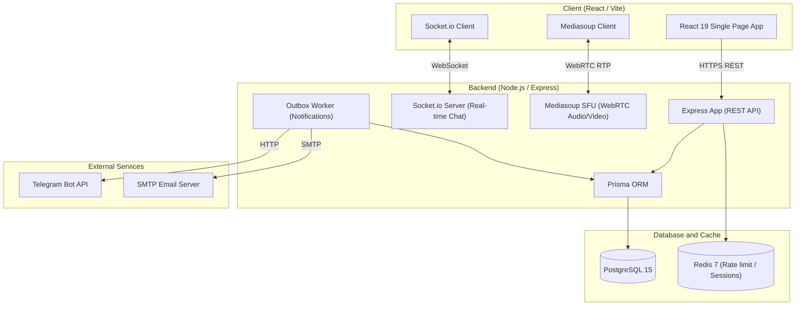

# myttrpg.me — Platform for organizing and running TTRPG campaigns

<p align="center">
  
</p>

<p align="center">
  <strong>Modern web space for tabletop role-playing game (TTRPG) enthusiasts</strong>
</p>

<p align="center">
  <a href="https://github.com/Kvarell/ttrpg-platform/actions/workflows/ci.yml">
    
  </a>
  <a href="https://sonarcloud.io/summary/new_code?id=Kvarell_ttrpg-platform">
    
  </a>
  <a href="https://sonarcloud.io/summary/new_code?id=Kvarell_ttrpg-platform">
    
  </a>
</p>

---

# Live Application

The platform is deployed and available for real-time use:

**URL:** [https://myttrpg.me](https://myttrpg.me)

---

## About the Project

**myttrpg.me** is an integrated web platform that provides the complete lifecycle of organizing, coordinating, and running tabletop role-playing games (TTRPGs). The application combines organizational tools (campaign management, game scheduling, financial balance) with interactive gaming tools (video communication, shared game chat, VTT virtual tabletop).

The platform is designed to simplify communication between Game Masters (GMs) and players, automate game registration processes, and provide high-quality connection without relying on third-party software.

---

## Key Features

### Campaign and Session Management

* **Campaigns:** Create campaigns with detailed descriptions, set the game system (D&D, Pathfinder, etc.), manage visibility (public or via link), and configure unique access tokens.
* **Sessions:** Schedule specific games by setting the date, time, duration, cost of participation, and player limit.
* **Join Requests:** An easy-to-use mechanism for submitting and moderating participation requests in campaigns, complete with status tracking.

### Interactive Media Calls (WebRTC / Mediasoup SFU)

* Built-in audio and video conferencing system directly within the game session.
* Based on the modern **Mediasoup SFU (Selective Forwarding Unit)** architecture, which guarantees low latency and minimal CPU load on user devices by intelligently routing streams instead of re-encoding them.

### Real-time Chat System

* Separate interactive chats for each campaign and session.
* Support for text communication, system messages (e.g., when a new player joins), as well as message editing and deletion.

### Built-in Financial System (Wallet & Transactions)

* Users' own virtual wallets with support for transaction history.
* Hosting paid sessions with automatic platform fee calculation and secure holding (escrow) of funds until the game is confirmed.

### Multi-channel Notifications

* Transactional message queue based on the **Outbox** pattern.
* Ability to receive notifications through three channels:
  * In-App notifications
  * Telegram bot (convenient connection using Telegram Chat ID)
  * Email notifications
* Detailed profile settings: quiet hours, category muting, and notification severity level configurations.

### Virtual Tabletop (VTT) and Logging

* Map visualization of game worlds and token management.
* **Client-side Event Logger:** A system for collecting client-side security and error logs for rapid monitoring and troubleshooting of client-side failures.

---

## Technology Stack

The platform is built on modern and high-performance technologies:

### Frontend

* **React 19** & **Vite 7** — fast rendering and modern application build tool
* **React Router 7** — routing
* **TanStack Query** (React Query) — efficient asynchronous state management and caching
* **Zustand** — lightweight global state management
* **Tailwind CSS** — responsive and flexible styling
* **Mediasoup Client** — integration with the WebRTC SFU media server

### Backend

* **Node.js 22** & **Express 5** — stable server platform and API
* **Prisma ORM** — object-relational mapping for convenient database interaction
* **Socket.io (WebSockets)** — bi-directional chat messaging implementation
* **Mediasoup SFU** — processing and routing of audio/video streams

### Database and Cache

* **PostgreSQL 15** — transactional and relational data storage
* **Redis 7** — rate limiting, sessions, and caching

### Testing and Code Quality

* **Vitest & Testing Library** — unit testing of the user interface
* **Playwright** — end-to-end (E2E) testing of critical user scenarios
* **Node Test Runner & c8** — server logic testing and coverage analysis
* **SonarCloud** — continuous code quality and security analysis

---

## System Architecture

The following diagram demonstrates the interaction of the main system components:



---

<details>
<summary>Local Startup and Development Guide</summary>

### Dependency Management

The project uses **npm workspaces** at the root level:

* All dependencies are installed from the root directory.
* A single `package-lock.json` file is used.
* **Important:** Do not create separate lock files in `client/` or `server/` directories.

#### Installing Dependencies

```bash
npm ci
```

### Local Startup

#### Startup using Docker Compose (Recommended)

All necessary services (Node, React, PostgreSQL, Redis) are configured for running together:

```bash
docker compose up --build
```

#### Startup without Docker (requires locally installed Postgres and Redis)

Run the server and the client in different terminals:

```bash
# Run backend
npm run dev:server

# Run frontend
npm run dev:client
```

### Useful Developer Scripts

```bash
# Build the project
npm run build
npm run build:client

# Static analysis (Linter)
npm run lint
npm run lint:client
npm run lint:server

# Run tests
npm run test
npm run test:client
npm run test:server
npm run test:e2e

# Test coverage analysis (Coverage)
npm run test:coverage
```

</details>
